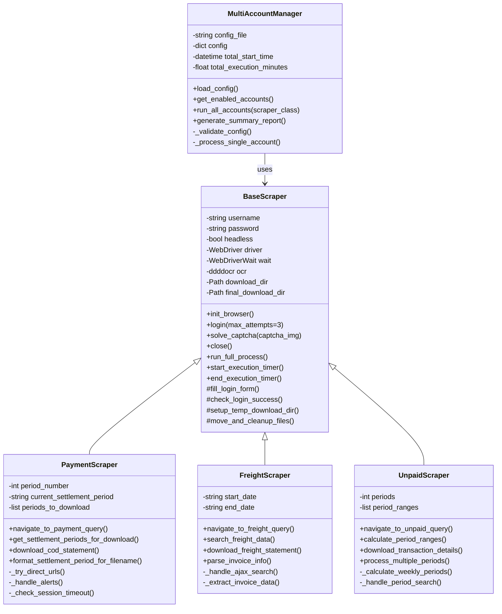
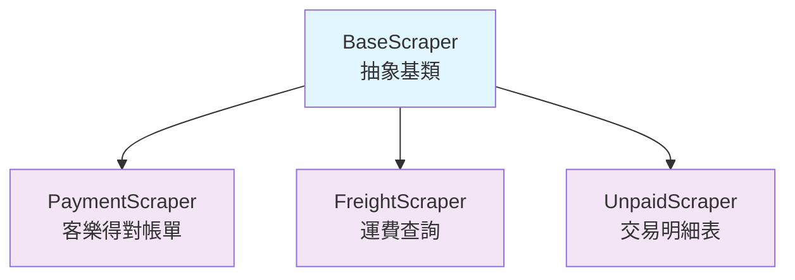

# SeleniumTCat 類別階層設計

## 類別架構概覽

SeleniumTCat 採用物件導向設計，以 **BaseScraper** 為核心抽象基類，透過繼承機制實現代碼重用和多型應用。整個類別系統遵循 SOLID 原則，確保高內聚、低耦合的設計。



## 基礎抽象類別設計

### BaseScraper - 抽象基類

**設計理念**：BaseScraper 作為抽象基類，定義了所有爬蟲共用的核心功能和標準流程，實現了 **Template Method Pattern**。

#### 類別結構

```python
class BaseScraper:
    """黑貓宅急便基礎抓取器類別"""

    def __init__(self, username, password, headless=False, download_base_dir="downloads"):
        # 基礎配置
        self.username = username
        self.password = password
        self.headless = headless

        # 瀏覽器相關
        self.driver = None
        self.wait = None

        # ddddocr 驗證碼識別
        self.ocr = ddddocr.DdddOcr(show_ad=False)

        # 檔案管理
        self.final_download_dir = Path(download_base_dir)
        self.download_dir = None

        # 執行狀態追蹤
        self.security_warning_encountered = False
        self.start_time = None
        self.end_time = None
```

#### 核心方法分類

##### 1. 公開介面方法 (Public Methods)
```python
def init_browser(self):
    """初始化瀏覽器 - 公開介面"""

def login(self, max_attempts=3):
    """執行登入流程 - 公開介面，支援重試機制"""

def solve_captcha(self, captcha_img_element):
    """驗證碼識別 - 公開介面，整合 ddddocr"""

def run_full_process(self):
    """執行完整流程 - Template Method，定義標準流程"""

def close(self):
    """關閉瀏覽器 - 公開介面，清理資源"""
```

##### 2. 保護方法 (Protected Methods)
```python
def _fill_login_form(self):
    """填寫登入表單 - 保護方法，內部使用"""

def _check_login_success(self):
    """檢查登入狀態 - 保護方法，內部邏輯"""

def _setup_temp_download_dir(self):
    """建立臨時下載目錄 - 保護方法，檔案管理"""

def _move_and_cleanup_files(self, downloaded_files, renamed_files):
    """檔案整理和清理 - 保護方法，檔案管理"""
```

##### 3. 抽象方法 (子類別必須實作)
雖然 Python 不強制抽象方法，但以下方法期望子類別覆寫：
```python
def navigate_to_query_page(self):
    """導航到查詢頁面 - 子類別應實作"""
    raise NotImplementedError("子類別必須實作此方法")

def download_data(self):
    """下載資料 - 子類別應實作"""
    raise NotImplementedError("子類別必須實作此方法")
```

#### Template Method 實作
```python
def run_full_process(self):
    """標準執行流程範本"""
    try:
        self.start_execution_timer()
        self.init_browser()

        # 步驟 1：登入
        if not self.login():
            return self._create_error_result("登入失敗")

        # 步驟 2：導航 (子類別實作)
        if not self.navigate_to_query_page():
            return self._create_error_result("導航失敗")

        # 步驟 3：下載資料 (子類別實作)
        downloaded_files = self.download_data()

        return self._create_success_result(downloaded_files)

    finally:
        self.end_execution_timer()
        self.close()
```

## 具體實作類別

### 1. PaymentScraper - 客樂得對帳單查詢工具

#### 類別特化設計

```python
class PaymentScraper(BaseScraper):
    """
    繼承 BaseScraper，專門處理貨到付款匯款明細
    特化功能：多期數下載、自動期間選擇
    """

    def __init__(self, username, password, headless=False,
                 download_base_dir="downloads", period_number=1):
        super().__init__(username, password, headless, download_base_dir)

        # PaymentScraper 特有屬性
        self.period_number = period_number
        self.current_settlement_period = None
        self.periods_to_download = []
```

#### 方法覆寫和擴展

```python
def navigate_to_query_page(self):
    """覆寫父類別方法 - 實作貨到付款查詢頁面導航"""
    return self.navigate_to_payment_query()

def download_data(self):
    """覆寫父類別方法 - 實作貨到付款資料下載"""
    # 1. 獲取結算期間
    periods_success = self.get_settlement_periods_for_download()
    if not periods_success:
        return []

    # 2. 下載每期資料
    downloaded_files = []
    for period_info in self.periods_to_download:
        files = self.download_cod_statement()
        downloaded_files.extend(files)

    return downloaded_files
```

#### 特化方法

```python
def navigate_to_payment_query(self):
    """PaymentScraper 特有的導航邏輯"""
    # 複雜的框架導航邏輯
    # 包含重試機制和會話恢復

def get_settlement_periods_for_download(self):
    """PaymentScraper 特有的期間選擇邏輯"""
    # 處理 ddlDate 選單
    # 支援多期數選擇

def download_cod_statement(self):
    """PaymentScraper 特有的下載邏輯"""
    # 處理 AJAX 搜尋
    # 檔案重命名和整理
```

### 2. FreightScraper - 運費查詢工具

#### 類別特化設計

```python
class FreightScraper(BaseScraper):
    """
    繼承 BaseScraper，專門處理運費對帳單
    特化功能：日期範圍查詢、發票資料解析
    """

    def __init__(self, username, password, headless=False,
                 download_base_dir="downloads", start_date=None, end_date=None):
        super().__init__(username, password, headless, download_base_dir)

        # FreightScraper 特有屬性
        self.start_date = start_date or self._get_default_start_date()
        self.end_date = end_date or self._get_default_end_date()
```

#### 特化方法

```python
def navigate_to_freight_query(self):
    """FreightScraper 特有的導航邏輯"""
    # 運費查詢頁面導航

def search_freight_data(self):
    """FreightScraper 特有的搜尋邏輯"""
    # 日期範圍搜尋
    # AJAX 處理

def parse_invoice_info(self, filename):
    """FreightScraper 特有的發票資訊解析"""
    # 從檔案名提取發票日期和號碼
```

### 3. UnpaidScraper - 交易明細表工具

#### 類別特化設計

```python
class UnpaidScraper(BaseScraper):
    """
    繼承 BaseScraper，專門處理交易明細表
    特化功能：週期搜尋、批次下載管理
    """

    def __init__(self, username, password, headless=False,
                 download_base_dir="downloads", periods=2):
        super().__init__(username, password, headless, download_base_dir)

        # UnpaidScraper 特有屬性
        self.periods = periods
        self.period_ranges = []
```

#### 特化方法

```python
def calculate_period_ranges(self):
    """UnpaidScraper 特有的週期計算邏輯"""
    # 計算每個週期的日期範圍

def process_multiple_periods(self):
    """UnpaidScraper 特有的多週期處理邏輯"""
    # 批次處理多個週期
```

## 管理器類別設計

### MultiAccountManager - 多帳號管理器

#### 設計模式應用

**MultiAccountManager** 應用了多種設計模式：

1. **Command Pattern**：將每個帳號的處理封裝為命令
2. **Strategy Pattern**：支援不同的 Scraper 策略
3. **Observer Pattern**：提供進度回呼機制

```python
class MultiAccountManager:
    """
    多帳號管理器 - 應用 Command Pattern 和 Strategy Pattern
    """

    def run_all_accounts(self, scraper_class, headless_override=None,
                        progress_callback=None, **scraper_kwargs):
        """
        Strategy Pattern 實作
        Args:
            scraper_class: 策略類別 (PaymentScraper/FreightScraper/UnpaidScraper)
            **scraper_kwargs: 策略特定參數
        """

        for account in self.get_enabled_accounts():
            # Command Pattern: 將帳號處理封裝為命令
            command = AccountProcessCommand(
                scraper_class, account, scraper_kwargs
            )
            result = command.execute()

            # Observer Pattern: 通知進度
            if progress_callback:
                progress_callback(result)
```

## 繼承關係和多型應用

### 繼承關係圖



### 多型應用示例

```python
def process_account_with_scraper(scraper_class, account_info):
    """多型應用：統一介面處理不同類型的 Scraper"""

    # 所有 Scraper 都有相同的建構子介面
    scraper = scraper_class(
        username=account_info["username"],
        password=account_info["password"],
        headless=account_info.get("headless", False)
    )

    # 多型：不同的 Scraper 有不同的實作，但介面相同
    result = scraper.run_full_process()

    return result

# 使用範例
process_account_with_scraper(PaymentScraper, account1)
process_account_with_scraper(FreightScraper, account2)
process_account_with_scraper(UnpaidScraper, account3)
```

## 介面設計原則

### 1. 統一的建構子介面
所有 Scraper 類別都遵循相同的建構子模式：
```python
def __init__(self, username, password, headless=False, download_base_dir="downloads", **kwargs):
```

### 2. 統一的執行介面
所有 Scraper 類別都提供相同的公開方法：
```python
def run_full_process(self) -> dict:
    """返回統一格式的執行結果"""
    return {
        "success": bool,
        "username": str,
        "downloads": list,
        "error": str  # 選用
    }
```

### 3. 統一的生命週期管理
```python
# 標準生命週期
scraper = ScraperClass(...)
try:
    result = scraper.run_full_process()
finally:
    scraper.close()  # 自動清理
```

## SOLID 原則應用

### 1. Single Responsibility Principle (SRP)
- **BaseScraper**：負責通用爬蟲功能
- **PaymentScraper**：負責貨到付款資料抓取
- **MultiAccountManager**：負責多帳號管理

### 2. Open/Closed Principle (OCP)
- 對擴展開放：可以輕易新增新的 Scraper 類別
- 對修改封閉：新增功能不需修改既有程式碼

### 3. Liskov Substitution Principle (LSP)
- 所有 Scraper 子類別都可以替換 BaseScraper
- MultiAccountManager 可以統一處理所有 Scraper 類別

### 4. Interface Segregation Principle (ISP)
- 提供最小化的介面，避免強迫實作不需要的方法
- 分離關注點：登入邏輯、下載邏輯、檔案管理邏輯

### 5. Dependency Inversion Principle (DIP)
- 高層模組 (MultiAccountManager) 不依賴低層模組 (具體 Scraper)
- 都依賴抽象 (BaseScraper 介面)

## 類別擴展指南

### 新增 Scraper 的標準步驟

1. **繼承 BaseScraper**
```python
class NewScraper(BaseScraper):
    def __init__(self, username, password, **kwargs):
        super().__init__(username, password, **kwargs)
        # 新增特有屬性
```

2. **實作必要方法**
```python
def navigate_to_query_page(self):
    """實作特定的導航邏輯"""

def download_data(self):
    """實作特定的下載邏輯"""
```

3. **遵循命名慣例**
- 公開方法：`method_name()`
- 保護方法：`_method_name()`
- 私有方法：`__method_name()`

4. **錯誤處理**
```python
try:
    # 業務邏輯
    pass
except SpecificException as e:
    self._log_error(f"特定錯誤: {e}")
    return self._create_error_result(str(e))
```

---

本類別階層設計確保了程式碼的可重用性、可維護性和可擴展性，為 SeleniumTCat 的持續發展提供了穩固的物件導向基礎。