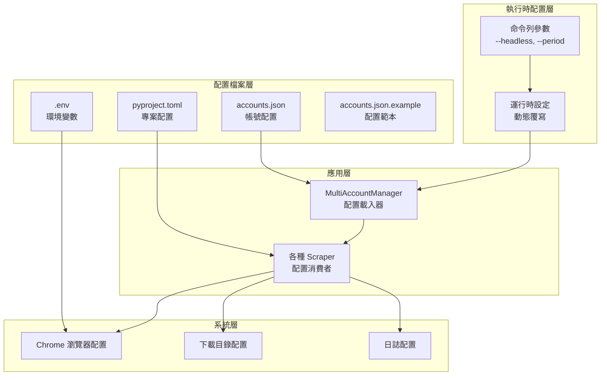
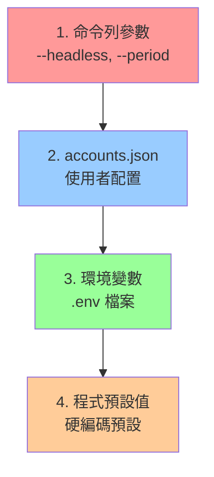

# SeleniumTCat 配置架構設計

## 配置系統概覽

SeleniumTCat 採用多層次配置架構，支援靈活的配置管理和環境適配。配置系統設計遵循 **最小權限原則** 和 **預設安全** 理念，確保系統既易於使用又足夠安全。



## 配置檔案詳解

### 1. accounts.json - 主配置檔

**檔案位置**：專案根目錄 `accounts.json`

**設計目的**：管理多個黑貓宅急便帳號和全域設定

#### 1.1 配置結構
```json
{
  "accounts": [
    {
      "username": "您的帳號1",
      "password": "您的密碼1",
      "enabled": true
    },
    {
      "username": "您的帳號2",
      "password": "您的密碼2",
      "enabled": false
    }
  ],
  "settings": {
    "headless": false,
    "download_base_dir": "downloads"
  }
}
```

#### 1.2 配置欄位說明

##### accounts 陣列
| 欄位 | 類型 | 必填 | 說明 |
|-----|------|------|------|
| `username` | string | ✓ | 黑貓宅急便帳號 |
| `password` | string | ✓ | 黑貓宅急便密碼 |
| `enabled` | boolean | ✗ | 是否啟用此帳號（預設：true） |

##### settings 物件
| 欄位 | 類型 | 預設值 | 說明 |
|-----|------|--------|------|
| `headless` | boolean | false | 瀏覽器無頭模式 |
| `download_base_dir` | string | "downloads" | 檔案下載基礎目錄 |

#### 1.3 配置載入邏輯
```python
class MultiAccountManager:
    def load_config(self):
        """載入並驗證配置檔案"""
        if not os.path.exists(self.config_file):
            raise FileNotFoundError(
                f"⛔ 設定檔 '{self.config_file}' 不存在！\n"
                "📝 請建立 accounts.json 檔案"
            )

        try:
            with open(self.config_file, 'r', encoding='utf-8') as f:
                self.config = json.load(f)

            # 驗證必要欄位
            if "accounts" not in self.config or not self.config["accounts"]:
                raise ValueError("⛔ 設定檔中沒有找到帳號資訊！")

        except json.JSONDecodeError as e:
            raise ValueError(f"⛔ 設定檔格式錯誤: {e}")
```

### 2. .env - 環境變數配置

**檔案位置**：專案根目錄 `.env`

**設計目的**：管理環境相關的配置，特別是 Chrome 瀏覽器路徑

#### 2.1 環境變數定義
```bash
# Chrome 瀏覽器執行檔路徑
CHROME_BINARY_PATH="/Applications/Google Chrome.app/Contents/MacOS/Google Chrome"

# 可選：WebDriver 相關設定
WEBDRIVER_TIMEOUT=30
IMPLICIT_WAIT=10
```

#### 2.2 平台特定配置

##### macOS
```bash
CHROME_BINARY_PATH="/Applications/Google Chrome.app/Contents/MacOS/Google Chrome"
```

##### Windows
```bash
CHROME_BINARY_PATH="C:\\Program Files\\Google\\Chrome\\Application\\chrome.exe"
```

##### Linux
```bash
CHROME_BINARY_PATH="/usr/bin/google-chrome"
```

#### 2.3 環境變數載入
```python
from dotenv import load_dotenv
import os

class BaseScraper:
    def __init__(self, ...):
        # 載入環境變數
        load_dotenv()

    def init_browser(self):
        # 使用環境變數配置 Chrome
        chrome_binary = os.getenv('CHROME_BINARY_PATH')
        if chrome_binary:
            chrome_options.binary_location = chrome_binary
```

### 3. pyproject.toml - 專案配置

**檔案位置**：專案根目錄 `pyproject.toml`

**設計目的**：定義專案元資料、依賴關係和建置配置

#### 3.1 專案元資料
```toml
[project]
name = "takkyubin-scraper"
version = "1.0.0"
description = "黑貓宅急便自動下載工具"
requires-python = ">=3.9"
```

#### 3.2 依賴管理
```toml
dependencies = [
    "selenium>=4.15.0",
    "webdriver-manager>=4.0.1",
    "requests>=2.31.0",
    "beautifulsoup4>=4.12.2",
    "openpyxl>=3.1.2",
    "python-dotenv>=1.0.0",
    "ddddocr==1.4.7",
    "onnxruntime>=1.16.0",
    "pillow<10.0.0",
    "numpy>=1.26.0,<2.0.0",
]
```

#### 3.3 uv 工具配置
```toml
[tool.uv]
dev-dependencies = []
```

### 4. accounts.json.example - 配置範本

**檔案位置**：專案根目錄 `accounts.json.example`

**設計目的**：提供配置檔案範本和說明

```json
{
  "accounts": [
    {
      "username": "您的帳號1",
      "password": "您的密碼1",
      "enabled": true
    },
    {
      "username": "您的帳號2",
      "password": "您的密碼2",
      "enabled": true
    },
    {
      "username": "您的帳號3",
      "password": "您的密碼3",
      "enabled": false
    }
  ],
  "settings": {
    "headless": false,
    "download_base_dir": "downloads"
  }
}
```

## 配置優先級系統

### 優先級順序



### 優先級實作

```python
class MultiAccountManager:
    def run_all_accounts(self, scraper_class, headless_override=None, **kwargs):
        """配置優先級處理"""
        settings = self.config.get("settings", {})

        # 1. 命令列參數 (最高優先級)
        if headless_override is not None:
            use_headless = headless_override
            safe_print(f"🔧 使用命令列 headless 設定: {use_headless}")

        # 2. accounts.json 設定
        else:
            use_headless = settings.get("headless", False)
            safe_print(f"🔧 使用設定檔 headless 設定: {use_headless}")

        # 3. 環境變數由各模組自行處理
        # 4. 程式預設值作為最後備選
```

## 配置驗證機制

### 1. 格式驗證

```python
def validate_accounts_config(config):
    """驗證 accounts.json 格式"""
    errors = []

    # 檢查必要欄位
    if "accounts" not in config:
        errors.append("缺少 'accounts' 欄位")

    if not isinstance(config["accounts"], list):
        errors.append("'accounts' 必須是陣列")

    # 驗證每個帳號
    for i, account in enumerate(config["accounts"]):
        if "username" not in account:
            errors.append(f"帳號 {i+1} 缺少 'username' 欄位")

        if "password" not in account:
            errors.append(f"帳號 {i+1} 缺少 'password' 欄位")

        if "enabled" in account and not isinstance(account["enabled"], bool):
            errors.append(f"帳號 {i+1} 的 'enabled' 必須是布林值")

    if errors:
        raise ValueError(f"配置檔案驗證失敗:\n" + "\n".join(f"- {error}" for error in errors))
```

### 2. 值驗證

```python
def validate_settings(settings):
    """驗證 settings 配置值"""
    if "headless" in settings and not isinstance(settings["headless"], bool):
        raise ValueError("'headless' 設定必須是布林值")

    if "download_base_dir" in settings:
        download_dir = Path(settings["download_base_dir"])
        try:
            download_dir.mkdir(parents=True, exist_ok=True)
        except Exception as e:
            raise ValueError(f"無法建立下載目錄 '{download_dir}': {e}")
```

## 安全性配置

### 1. 敏感資訊保護

#### 1.1 .gitignore 配置
```bash
# 敏感配置檔案
accounts.json
.env

# 保留範例檔案
!accounts.json.example
!.env.example
```

#### 1.2 檔案權限建議
```bash
# Linux/macOS 設定檔案權限
chmod 600 accounts.json
chmod 600 .env
```

#### 1.3 密碼安全建議
- 使用強密碼
- 定期更換密碼
- 不在公開場所編輯配置檔
- 考慮使用環境變數代替明文密碼

### 2. 配置檔案加密（可選擴展）

```python
# 未來可實作的加密功能
class EncryptedConfig:
    def encrypt_passwords(self, config, key):
        """加密配置檔中的密碼"""
        pass

    def decrypt_passwords(self, config, key):
        """解密配置檔中的密碼"""
        pass
```

## 動態配置機制

### 1. 運行時配置覆寫

```python
class BaseScraper:
    def __init__(self, username, password, **dynamic_config):
        """支援動態配置參數"""
        # 基礎配置
        self.username = username
        self.password = password

        # 動態配置覆寫
        self.headless = dynamic_config.get('headless', False)
        self.download_base_dir = dynamic_config.get('download_base_dir', 'downloads')
        self.timeout = dynamic_config.get('timeout', 30)
```

### 2. 特化參數傳遞

```python
# PaymentScraper 特化參數
manager.run_all_accounts(
    PaymentScraper,
    period_number=3,  # 特化參數
    headless_override=True  # 運行時覆寫
)

# FreightScraper 特化參數
manager.run_all_accounts(
    FreightScraper,
    start_date="20241201",  # 特化參數
    end_date="20241208"     # 特化參數
)
```

## 配置最佳實務

### 1. 開發環境配置

```json
{
  "accounts": [
    {
      "username": "test_account",
      "password": "test_password",
      "enabled": true
    }
  ],
  "settings": {
    "headless": false,
    "download_base_dir": "downloads/dev"
  }
}
```

### 2. 生產環境配置

```json
{
  "accounts": [
    {
      "username": "prod_account1",
      "password": "strong_password1",
      "enabled": true
    },
    {
      "username": "prod_account2",
      "password": "strong_password2",
      "enabled": true
    }
  ],
  "settings": {
    "headless": true,
    "download_base_dir": "/var/data/downloads"
  }
}
```

### 3. 配置檔案管理

#### 建立配置檔案
```bash
# 複製範例檔案
cp accounts.json.example accounts.json
cp .env.example .env

# 編輯配置
nano accounts.json
nano .env
```

#### 驗證配置
```bash
# 使用乾燥運行模式驗證配置
python -m src.scrapers.payment_scraper --dry-run
```

### 4. 故障排除

#### 常見配置錯誤

1. **JSON 格式錯誤**
```json
// 錯誤：有註解
{
  "accounts": [...] // 這是錯誤的
}

// 正確：無註解
{
  "accounts": [...]
}
```

2. **路徑問題**
```bash
# 錯誤：相對路徑在不同系統可能失效
CHROME_BINARY_PATH="./chrome/chrome.exe"

# 正確：絕對路徑
CHROME_BINARY_PATH="C:\\Program Files\\Google\\Chrome\\Application\\chrome.exe"
```

3. **編碼問題**
```python
# 確保使用 UTF-8 編碼讀取配置
with open(self.config_file, 'r', encoding='utf-8') as f:
    self.config = json.load(f)
```

#### 配置診斷工具

```python
def diagnose_config():
    """配置診斷工具"""
    print("🔍 SeleniumTCat 配置診斷")

    # 檢查配置檔案存在
    config_files = {
        'accounts.json': Path('accounts.json').exists(),
        '.env': Path('.env').exists(),
        'pyproject.toml': Path('pyproject.toml').exists()
    }

    for file, exists in config_files.items():
        status = "✅" if exists else "❌"
        print(f"{status} {file}")

    # 檢查 Chrome 路徑
    chrome_path = os.getenv('CHROME_BINARY_PATH')
    if chrome_path and Path(chrome_path).exists():
        print(f"✅ Chrome 路徑: {chrome_path}")
    else:
        print(f"❌ Chrome 路徑無效: {chrome_path}")
```

---

本配置架構設計確保了 SeleniumTCat 的靈活性、安全性和可維護性，為不同環境和需求提供了完善的配置支援。