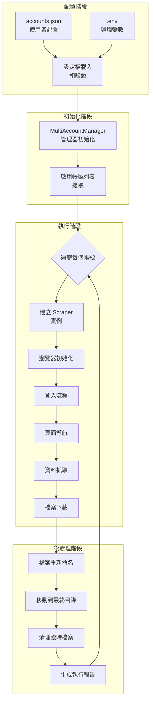
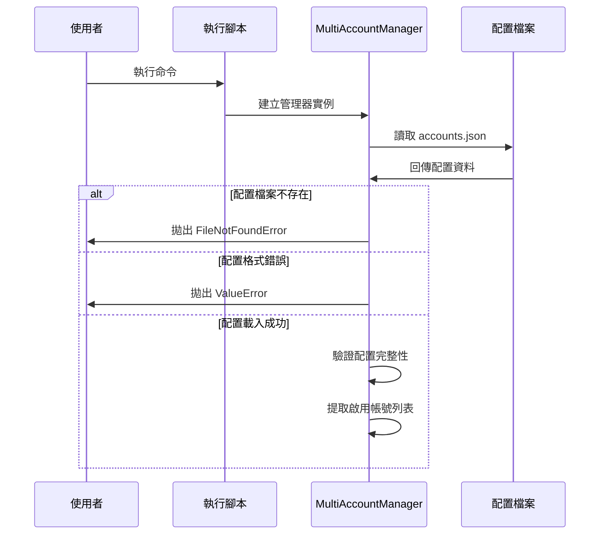
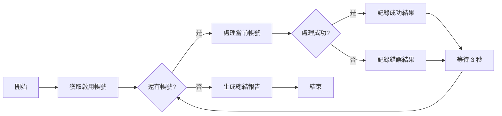
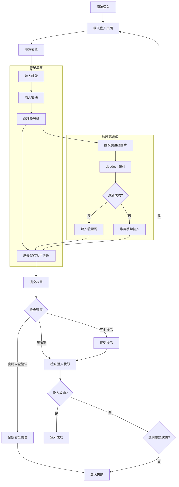
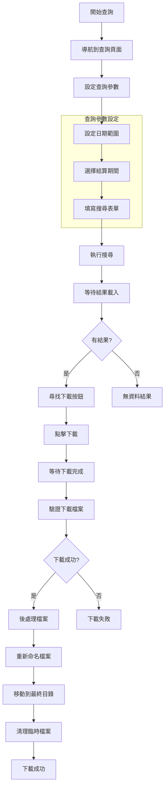
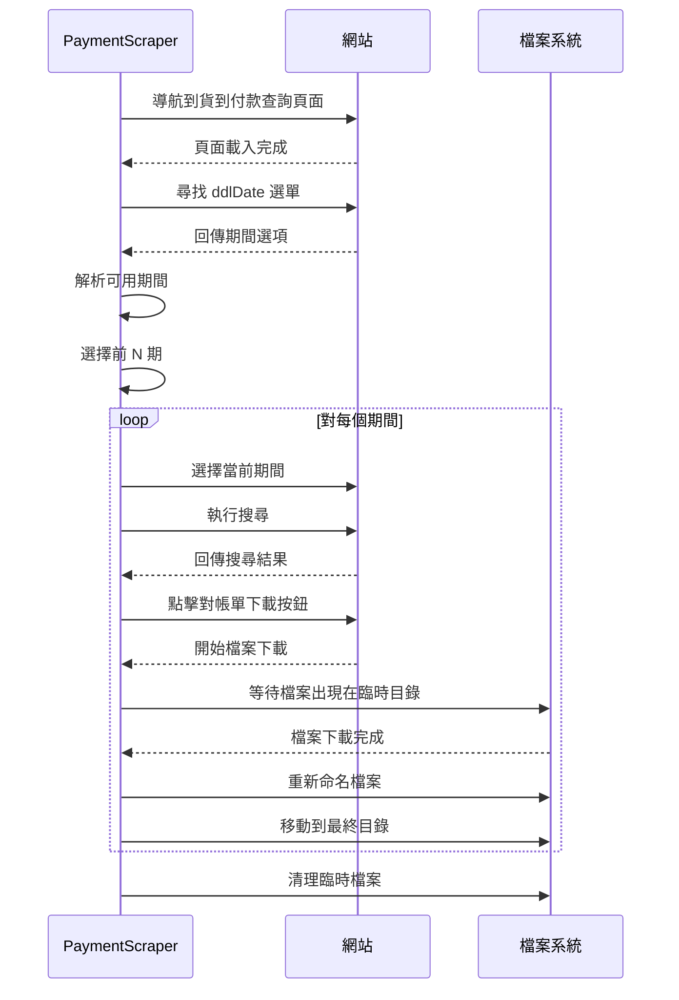
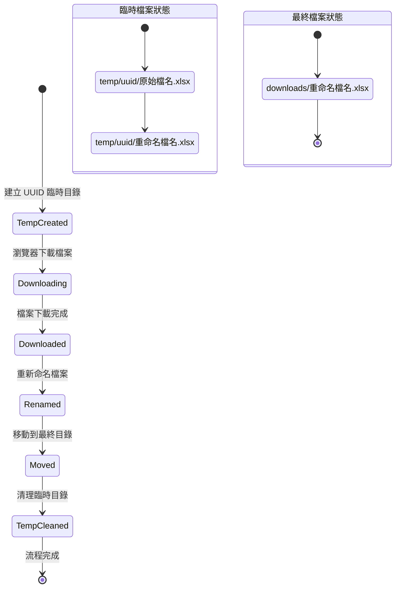
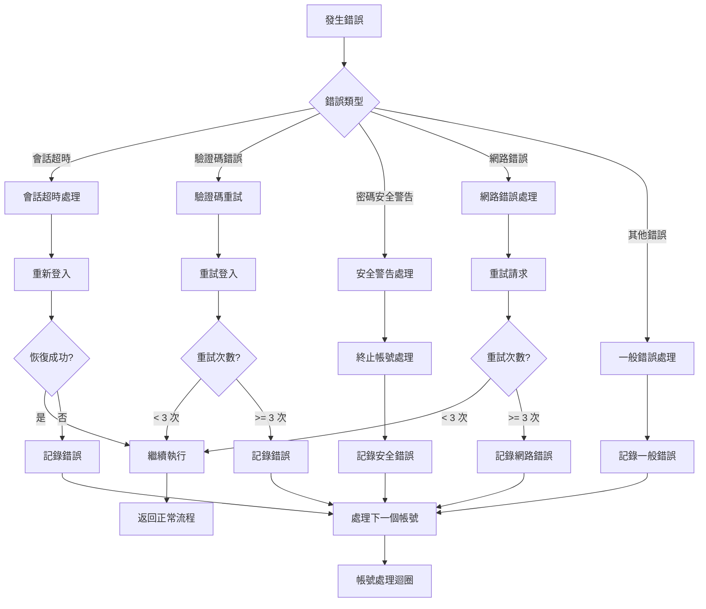
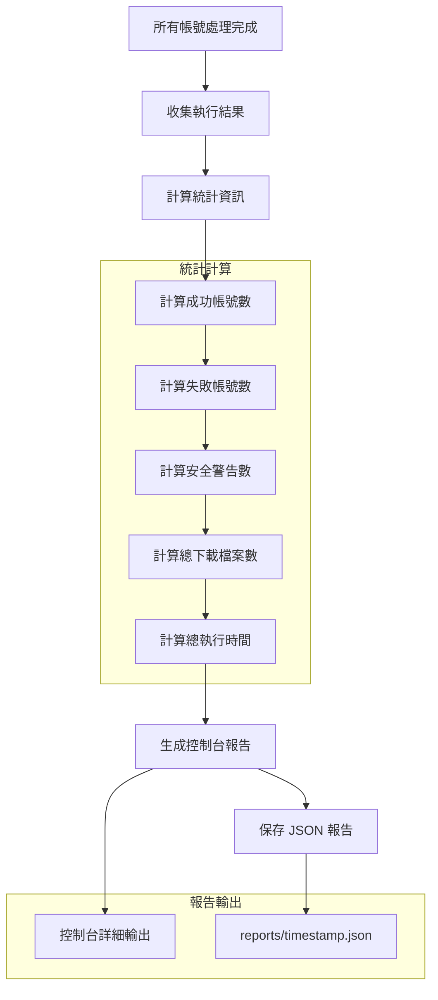

# SeleniumTCat 資料流程設計

## 資料流程概覽

SeleniumTCat 的資料流程涵蓋從使用者配置到最終檔案輸出的完整生命週期。系統設計了多層次的資料處理機制，確保資料的完整性、一致性和可追溯性。



## 詳細資料流程分析

### 1. 配置載入和驗證流程

#### 1.1 配置檔案結構
```json
{
  "accounts": [
    {
      "username": "帳號1",
      "password": "密碼1",
      "enabled": true
    }
  ],
  "settings": {
    "headless": false,
    "download_base_dir": "downloads"
  }
}
```

#### 1.2 配置載入流程


### 2. 多帳號批次處理流程

#### 2.1 帳號處理順序


#### 2.2 個別帳號處理流程
```mermaid
sequenceDiagram
    participant MAM as MultiAccountManager
    participant Scraper as PaymentScraper
    participant Browser as Chrome Browser
    participant Website as 黑貓宅急便網站

    MAM->>Scraper: 建立 Scraper 實例
    Scraper->>Browser: 初始化瀏覽器
    Browser-->>Scraper: 瀏覽器就緒

    Scraper->>Website: 前往登入頁面
    Website-->>Scraper: 載入登入頁面

    loop 最多 3 次重試
        Scraper->>Website: 填寫登入表單
        Scraper->>Website: 提交表單
        Website-->>Scraper: 登入回應

        alt 登入成功
            break 跳出重試迴圈
        else 登入失敗
            Scraper->>Scraper: 準備重試
        end
    end

    alt 登入最終成功
        Scraper->>Website: 導航到查詢頁面
        Scraper->>Website: 執行資料查詢
        Website-->>Scraper: 回傳查詢結果
        Scraper->>Website: 下載檔案
        Website-->>Scraper: 下載完成
        Scraper->>Scraper: 檔案後處理
        Scraper-->>MAM: 回傳成功結果
    else 登入失敗
        Scraper-->>MAM: 回傳失敗結果
    end

    Scraper->>Browser: 關閉瀏覽器
```

### 3. 登入和驗證碼處理流程

#### 3.1 登入流程詳解


#### 3.2 ddddocr 驗證碼識別流程
```python
def solve_captcha(self, captcha_img_element):
    """驗證碼識別流程"""
    # 1. 截取驗證碼圖片
    screenshot = captcha_img_element.screenshot_as_png

    # 2. ddddocr 識別
    result = self.ocr.classification(screenshot)

    # 3. 結果驗證
    if result and len(result) >= 4:  # 通常為 4 位數字
        return result
    else:
        return None  # 識別失敗
```

### 4. 資料抓取和下載流程

#### 4.1 通用資料抓取流程


#### 4.2 PaymentScraper 特化流程


### 5. 檔案管理流程

#### 5.1 檔案生命週期


#### 5.2 檔案命名規則
```python
# PaymentScraper 檔案命名
filename_pattern = "客樂得對帳單_{username}_{period}.xlsx"

# FreightScraper 檔案命名
filename_pattern = "發票明細_{username}_{invoice_date}_{invoice_number}.xlsx"

# UnpaidScraper 檔案命名
filename_pattern = "交易明細表_{username}_{start_date}-{end_date}.xlsx"
```

### 6. 錯誤處理和恢復機制

#### 6.1 錯誤處理流程


#### 6.2 會話超時恢復機制
```mermaid
sequenceDiagram
    participant Scraper as BaseScraper
    participant Browser as Chrome
    participant Website as 黑貓宅急便

    Scraper->>Website: 執行操作
    Website-->>Scraper: 會話超時回應

    Scraper->>Scraper: 檢測會話超時
    Note over Scraper: _check_session_timeout()

    loop 嘗試多個登入 URL
        Scraper->>Browser: 清除 Cookies
        Scraper->>Website: 前往登入頁面

        alt 成功到達登入頁面
            Scraper->>Scraper: 重新執行登入流程
            Scraper->>Website: 登入

            alt 登入成功
                Website-->>Scraper: 登入成功
                break 恢復成功
            else 登入失敗
                continue 嘗試下一個 URL
            end
        else 無法到達登入頁面
            continue 嘗試下一個 URL
        end
    end

    alt 恢復成功
        Scraper->>Scraper: 返回正常流程
    else 恢復失敗
        Scraper->>Scraper: 記錄錯誤並跳過帳號
    end
```

### 7. 報告生成流程

#### 7.1 執行報告結構
```mermaid
classDiagram
    class ExecutionReport {
        +string execution_time
        +string total_start_time
        +string total_end_time
        +float total_execution_minutes
        +int total_accounts
        +int successful_accounts
        +int failed_accounts
        +int security_warning_accounts
        +int total_downloads
        +list~AccountResult~ details
    }

    class AccountResult {
        +bool success
        +string username
        +list~string~ downloads
        +int records
        +float duration_minutes
        +string start_time
        +string end_time
        +string error
        +string error_type
        +string message
    }

    ExecutionReport ||--o{ AccountResult
```

#### 7.2 報告生成流程


### 8. 資料流程最佳化

#### 8.1 效能最佳化策略
- **檔案流**：使用 UUID 臨時目錄避免檔案衝突
- **記憶體管理**：及時清理不需要的物件和資源
- **網路最佳化**：智慧重試機制和超時設定
- **並行處理**：雖然帳號間是序列處理，但內部操作有並行最佳化

#### 8.2 資料完整性保證
- **原子操作**：檔案移動使用原子操作
- **錯誤隔離**：單一帳號錯誤不影響其他帳號
- **狀態追蹤**：完整的執行狀態記錄
- **回滾機制**：下載失敗時的清理機制

---

本資料流程設計確保了系統的可靠性、可追溯性和可維護性，為 SeleniumTCat 的穩定運行提供了完整的資料處理保障。