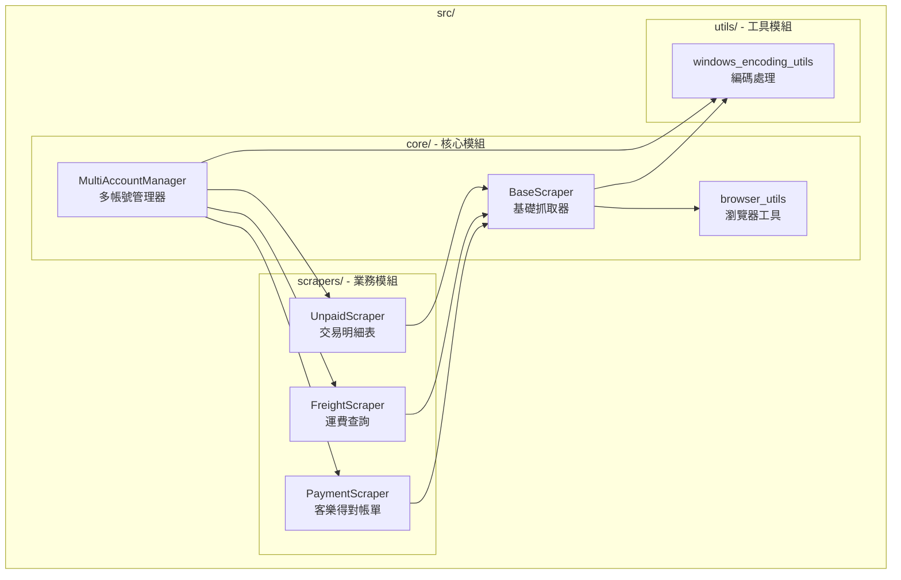
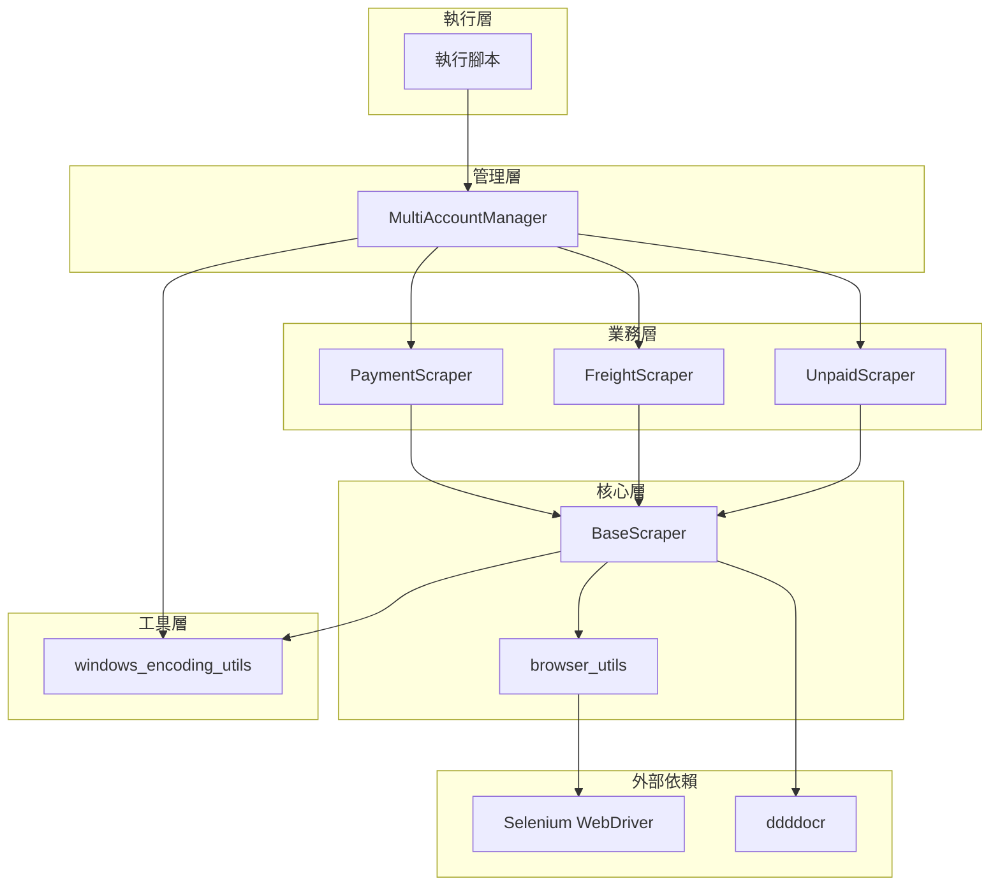

# SeleniumTCat 模組設計

## 模組架構概覽

SeleniumTCat 採用分層模組化架構，將功能按責任劃分為不同的模組。每個模組都有明確的職責邊界和介面定義，確保系統的可維護性和可擴展性。



## 核心模組 (src/core/)

### 1. BaseScraper - 基礎抓取器

**檔案位置**：`src/core/base_scraper.py`

**設計目的**：提供所有爬蟲共用的核心功能，包括瀏覽器管理、登入流程、驗證碼處理等。

#### 核心功能

##### 1.1 瀏覽器管理
```python
class BaseScraper:
    def init_browser(self):
        """初始化瀏覽器 - 使用 browser_utils 模組"""
        self.driver, self.wait = init_chrome_browser(
            headless=self.headless,
            download_dir=str(default_download_dir.absolute())
        )
```

##### 1.2 ddddocr 驗證碼識別整合
```python
def solve_captcha(self, captcha_img_element):
    """使用 ddddocr 自動識別驗證碼"""
    screenshot = captcha_img_element.screenshot_as_png
    result = self.ocr.classification(screenshot)
    return result
```

##### 1.3 智慧登入流程
- 支援最多 3 次重試
- 自動填寫帳號、密碼、驗證碼
- 自動選擇契約客戶專區
- 智慧檢測登入成功/失敗狀態

##### 1.4 檔案管理系統
```python
def setup_temp_download_dir(self):
    """建立 UUID 臨時下載目錄"""
    import uuid
    temp_uuid = str(uuid.uuid4())
    self.download_dir = Path("temp") / temp_uuid

def move_and_cleanup_files(self, downloaded_files, renamed_files):
    """移動檔案到最終目錄並清理臨時檔案"""
```

#### 設計模式
- **Template Method Pattern**：定義抽象的執行流程
- **Strategy Pattern**：不同爬蟲實作不同的資料抓取策略
- **Factory Method Pattern**：統一的瀏覽器初始化介面

### 2. MultiAccountManager - 多帳號管理器

**檔案位置**：`src/core/multi_account_manager.py`

**設計目的**：管理多個帳號的批次處理，提供統一的執行介面和報告生成。

#### 核心功能

##### 2.1 配置管理
```python
def load_config(self):
    """載入並驗證 accounts.json 配置"""
    with open(self.config_file, 'r', encoding='utf-8') as f:
        self.config = json.load(f)
```

##### 2.2 依賴注入模式
```python
def run_all_accounts(self, scraper_class, headless_override=None, **scraper_kwargs):
    """
    執行所有啟用的帳號
    Args:
        scraper_class: 要使用的抓取器類別 (例如 PaymentScraper)
        **scraper_kwargs: 額外的 scraper 參數
    """
```

##### 2.3 統計報告生成
- 執行時間統計
- 成功/失敗帳號統計
- 下載檔案統計
- 詳細錯誤報告

#### 設計特色
- **Dependency Injection**：支援不同的 Scraper 類別
- **Command Pattern**：統一的執行介面
- **Observer Pattern**：進度回呼機制

### 3. browser_utils - 瀏覽器工具

**檔案位置**：`src/core/browser_utils.py`

**設計目的**：提供跨平台的 Chrome WebDriver 初始化和配置功能。

#### 核心功能

##### 3.1 跨平台 Chrome 支援
```python
def init_chrome_browser(headless=False, download_dir="downloads"):
    """
    初始化 Chrome WebDriver
    支援 Windows、macOS、Linux
    """
    chrome_options = webdriver.ChromeOptions()

    # 從 .env 載入 Chrome 執行檔路徑
    chrome_binary = os.getenv('CHROME_BINARY_PATH')
    if chrome_binary:
        chrome_options.binary_location = chrome_binary
```

##### 3.2 下載設定最佳化
- 自動下載允許
- 指定下載目錄
- 禁用彈出視窗
- 無頭模式支援

## 業務模組 (src/scrapers/)

### 設計原則

所有業務模組都繼承自 `BaseScraper`，遵循 **Liskov Substitution Principle**，確保可以被 `MultiAccountManager` 統一管理。

```python
class PaymentScraper(BaseScraper):
    """繼承 BaseScraper 的具體實作"""
```

### 1. PaymentScraper - 客樂得對帳單查詢工具

**檔案位置**：`src/scrapers/payment_scraper.py`

#### 特化功能
- **多期數下載**：支援 `--period` 參數指定下載期數
- **自動期間選擇**：自動選擇最新結算區間
- **特殊導航邏輯**：專門處理帳務選單導航

#### 核心方法
```python
def navigate_to_payment_query(self):
    """導航到貨到付款查詢頁面"""

def get_settlement_periods_for_download(self):
    """獲取要下載的多期結算區間"""

def download_cod_statement(self):
    """下載貨到付款匯款明細表"""
```

### 2. FreightScraper - 運費查詢工具

**檔案位置**：`src/scrapers/freight_scraper.py`

#### 特化功能
- **日期範圍查詢**：支援 `--start-date` 和 `--end-date` 參數
- **AJAX 搜尋處理**：處理動態載入的搜尋結果
- **發票資料解析**：從檔案名提取發票資訊

### 3. UnpaidScraper - 交易明細表工具

**檔案位置**：`src/scrapers/unpaid_scraper.py`

#### 特化功能
- **週期搜尋**：支援 `--periods` 參數指定週期數
- **動態日期計算**：自動計算每個週期的日期範圍
- **批次下載管理**：管理多個週期的檔案下載

## 工具模組 (src/utils/)

### 1. windows_encoding_utils - 編碼處理工具

**檔案位置**：`src/utils/windows_encoding_utils.py`

#### 核心功能

##### 1.1 安全輸出函數
```python
def safe_print(text):
    """
    Windows 相容的安全輸出函數
    將 Unicode 字符轉換為純文字標籤
    """
    replacements = {
        '✅': '[成功]',
        '❌': '[失敗]',
        '🎉': '[完成]',
        '⚠️': '[警告]',
        # ... 更多替換規則
    }
```

##### 1.2 環境檢查
```python
def check_pythonunbuffered():
    """檢查並提醒設定 PYTHONUNBUFFERED 環境變數"""
```

## 模組間依賴關係



## 設計模式應用

### 1. Template Method Pattern
**BaseScraper** 定義標準執行流程：
```python
def run_full_process(self):
    """標準執行流程範本"""
    self.init_browser()
    self.login()
    self.navigate_to_query_page()  # 子類別實作
    self.download_data()          # 子類別實作
    self.close()
```

### 2. Strategy Pattern
不同 Scraper 實作不同的資料抓取策略：
- **PaymentScraper**：期數選擇策略
- **FreightScraper**：日期範圍策略
- **UnpaidScraper**：週期處理策略

### 3. Dependency Injection
**MultiAccountManager** 透過建構子注入不同的 Scraper：
```python
manager.run_all_accounts(PaymentScraper, period_number=2)
manager.run_all_accounts(FreightScraper, start_date="20241201")
```

### 4. Factory Method Pattern
**browser_utils** 提供統一的瀏覽器建立介面：
```python
driver, wait = init_chrome_browser(headless=True, download_dir="/path")
```

## 模組擴展指南

### 新增 Scraper 步驟

1. **繼承 BaseScraper**
```python
class NewScraper(BaseScraper):
    def __init__(self, username, password, **kwargs):
        super().__init__(username, password, **kwargs)
```

2. **實作必要方法**
```python
def navigate_to_query_page(self):
    """實作特定的導航邏輯"""
    pass

def download_data(self):
    """實作特定的下載邏輯"""
    pass
```

3. **更新 MultiAccountManager**
```python
# 使用時
manager.run_all_accounts(NewScraper, custom_param=value)
```

### 模組設計原則

1. **單一職責原則**：每個模組只負責一個特定功能
2. **開放封閉原則**：對擴展開放，對修改封閉
3. **依賴反轉原則**：依賴抽象而非具體實作
4. **介面隔離原則**：提供最小化的介面

---

本模組設計確保了系統的可維護性、可擴展性和可測試性，為 SeleniumTCat 的長期發展提供了穩固的架構基礎。