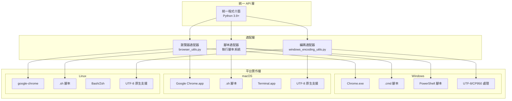
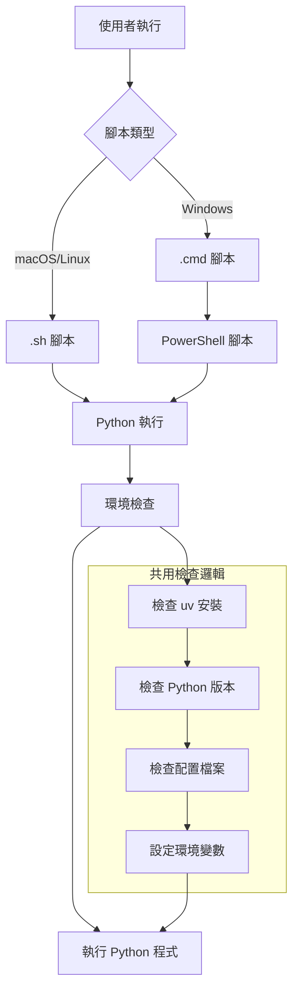

# SeleniumTCat 平台支援架構

## 跨平台支援概覽

SeleniumTCat 採用 **"一次編寫，處處執行"** 的設計理念，透過統一的 API 介面和智慧適配機制，實現在 Windows、macOS、Linux 三大主流作業系統上的無縫運行。



## 平台特性對比

### 系統需求比較表

| 特性 | Windows | macOS | Linux |
|-----|---------|-------|-------|
| **Python 版本** | 3.9+ | 3.9+ | 3.9+ |
| **Chrome 瀏覽器** | Chrome.exe | Google Chrome.app | google-chrome |
| **執行腳本** | .cmd + .ps1 | .sh | .sh |
| **字元編碼** | UTF-8/CP950 | UTF-8 | UTF-8 |
| **套件管理** | uv | uv | uv |
| **檔案路徑** | 反斜線 \ | 斜線 / | 斜線 / |
| **權限管理** | UAC | sudo | sudo |

### 支援版本矩陣

| 作業系統 | 支援版本 | 測試狀態 | 建議版本 |
|----------|----------|----------|----------|
| **Windows** | 10, 11 | ✅ 完整測試 | Windows 11 |
| **macOS** | 10.15+ | ✅ 完整測試 | macOS 13+ |
| **Ubuntu** | 18.04+ | ✅ 完整測試 | Ubuntu 22.04 |
| **CentOS** | 7+ | ⚠️ 基本測試 | CentOS 8 |
| **Debian** | 10+ | ⚠️ 基本測試 | Debian 11 |

## Windows 平台支援

### 1. 執行環境配置

#### 1.1 Chrome 瀏覽器路徑
```bash
# .env 檔案配置
CHROME_BINARY_PATH="C:\Program Files\Google\Chrome\Application\chrome.exe"
# 或
CHROME_BINARY_PATH="C:\Program Files (x86)\Google\Chrome\Application\chrome.exe"
```

#### 1.2 執行腳本系統

**PowerShell 智慧啟動機制**：
```cmd
@echo off
setlocal EnableDelayedExpansion

REM Windows_客樂得對帳單.cmd
echo 🐱 黑貓宅急便自動下載工具

REM 智慧啟動 PowerShell
where pwsh >nul 2>&1
if !errorlevel! equ 0 (
    REM PowerShell 7 可用
    echo 🚀 啟動 PowerShell 7...
    pwsh -NoProfile -File "PowerShell_客樂得對帳單.ps1" %*
) else (
    REM 回退到 Windows PowerShell
    echo 🚀 啟動 Windows PowerShell...
    powershell -NoProfile -File "PowerShell_客樂得對帳單.ps1" %*
)

pause
```

#### 1.3 編碼處理機制

**Unicode 字符轉換**：
```python
def safe_print(text):
    """Windows 相容的安全輸出函數"""
    replacements = {
        '✅': '[成功]',
        '❌': '[失敗]',
        '🎉': '[完成]',
        '⚠️': '[警告]',
        '🔍': '[搜尋]',
        '📥': '[下載]',
        '🐱': '[黑貓]',
        '🚀': '[啟動]',
        # ... 更多替換規則
    }

    safe_text = text
    for unicode_char, replacement in replacements.items():
        safe_text = safe_text.replace(unicode_char, replacement)

    print(safe_text)
```

### 2. Windows 特有問題解決

#### 2.1 路徑處理
```python
# 正確的 Windows 路徑處理
from pathlib import Path

def get_windows_path(path_str):
    """Windows 路徑正規化"""
    path = Path(path_str)
    return str(path.absolute()).replace('/', '\\')
```

#### 2.2 UAC 權限處理
```powershell
# PowerShell 腳本中的權限檢查
function Test-AdminRights {
    $currentUser = [System.Security.Principal.WindowsIdentity]::GetCurrent()
    $principal = New-Object System.Security.Principal.WindowsPrincipal($currentUser)
    return $principal.IsInRole([System.Security.Principal.WindowsBuiltInRole]::Administrator)
}
```

## macOS 平台支援

### 1. 執行環境配置

#### 1.1 Chrome 瀏覽器路徑
```bash
# .env 檔案配置
CHROME_BINARY_PATH="/Applications/Google Chrome.app/Contents/MacOS/Google Chrome"
```

#### 1.2 執行腳本設計
```bash
#!/bin/bash
# Linux_客樂得對帳單.sh

echo "🐱 黑貓宅急便自動下載工具"

# 檢查 uv 是否安裝
if ! command -v uv &> /dev/null; then
    echo "❌ uv 未安裝，請先安裝 uv"
    echo "安裝指令：curl -LsSf https://astral.sh/uv/install.sh | sh"
    read -p "按 Enter 鍵退出..."
    exit 1
fi

# 設定環境變數
export PYTHONUNBUFFERED=1
export PYTHONPATH="$(pwd)"

# 執行程式
uv run python -u src/scrapers/payment_scraper.py "$@"

echo "執行完成"
read -p "按 Enter 鍵退出..."
```

### 2. macOS 特有功能

#### 2.1 Homebrew 整合
```bash
# 自動安裝相依性
install_dependencies() {
    if command -v brew &> /dev/null; then
        echo "📦 使用 Homebrew 安裝 Chrome..."
        brew install --cask google-chrome
    fi
}
```

#### 2.2 應用程式包整合
```python
def find_chrome_on_macos():
    """在 macOS 上尋找 Chrome"""
    possible_paths = [
        "/Applications/Google Chrome.app/Contents/MacOS/Google Chrome",
        "/Applications/Chromium.app/Contents/MacOS/Chromium",
        "/usr/local/bin/google-chrome"
    ]

    for path in possible_paths:
        if Path(path).exists():
            return path

    return None
```

## Linux 平台支援

### 1. 發行版適配

#### 1.1 套件管理器支援
```bash
# 自動偵測發行版並安裝 Chrome
install_chrome_linux() {
    if command -v apt &> /dev/null; then
        # Ubuntu/Debian
        sudo apt update
        sudo apt install -y google-chrome-stable
    elif command -v yum &> /dev/null; then
        # CentOS/RHEL
        sudo yum install -y google-chrome-stable
    elif command -v dnf &> /dev/null; then
        # Fedora
        sudo dnf install -y google-chrome-stable
    fi
}
```

#### 1.2 Chrome 路徑偵測
```python
def find_chrome_on_linux():
    """在 Linux 上尋找 Chrome"""
    possible_paths = [
        "/usr/bin/google-chrome",
        "/usr/bin/google-chrome-stable",
        "/usr/bin/chromium",
        "/usr/bin/chromium-browser",
        "/snap/bin/chromium"
    ]

    for path in possible_paths:
        if Path(path).exists():
            return path

    return None
```

### 2. Linux 特有配置

#### 2.1 X11/Wayland 支援
```python
def setup_linux_display():
    """設定 Linux 顯示環境"""
    chrome_options = webdriver.ChromeOptions()

    # Wayland 支援
    if os.environ.get('WAYLAND_DISPLAY'):
        chrome_options.add_argument('--enable-features=UseOzonePlatform')
        chrome_options.add_argument('--ozone-platform=wayland')

    # X11 支援
    if os.environ.get('DISPLAY'):
        chrome_options.add_argument(f'--display={os.environ["DISPLAY"]}')

    return chrome_options
```

#### 2.2 權限管理
```bash
# 檢查執行權限
check_permissions() {
    if [ ! -x "./Linux_客樂得對帳單.sh" ]; then
        echo "🔧 設定執行權限..."
        chmod +x *.sh
    fi
}
```

## 智慧平台偵測

### 1. 平台識別機制

```python
import platform
import os
from pathlib import Path

class PlatformDetector:
    """平台偵測器"""

    @staticmethod
    def get_platform():
        """取得當前平台"""
        system = platform.system().lower()
        if system == "windows":
            return "windows"
        elif system == "darwin":
            return "macos"
        elif system == "linux":
            return "linux"
        else:
            return "unknown"

    @staticmethod
    def get_chrome_path():
        """取得平台對應的 Chrome 路徑"""
        platform_name = PlatformDetector.get_platform()

        chrome_paths = {
            "windows": [
                r"C:\Program Files\Google\Chrome\Application\chrome.exe",
                r"C:\Program Files (x86)\Google\Chrome\Application\chrome.exe"
            ],
            "macos": [
                "/Applications/Google Chrome.app/Contents/MacOS/Google Chrome"
            ],
            "linux": [
                "/usr/bin/google-chrome",
                "/usr/bin/google-chrome-stable",
                "/usr/bin/chromium"
            ]
        }

        for path in chrome_paths.get(platform_name, []):
            if Path(path).exists():
                return path

        return None
```

### 2. 自動配置生成

```python
def generate_env_file():
    """自動生成 .env 配置檔"""
    chrome_path = PlatformDetector.get_chrome_path()

    if chrome_path:
        with open('.env', 'w', encoding='utf-8') as f:
            f.write(f'CHROME_BINARY_PATH="{chrome_path}"\n')
        print(f"✅ 已自動設定 Chrome 路徑: {chrome_path}")
    else:
        print("⚠️ 未找到 Chrome，請手動設定 .env 檔案")
```

## 執行腳本架構

### 1. 統一腳本介面



### 2. 腳本功能對照

| 功能 | Windows .cmd | PowerShell .ps1 | macOS/Linux .sh |
|------|--------------|-----------------|------------------|
| **環境檢查** | ✓ | ✓ | ✓ |
| **顏色輸出** | 基本 | 完整 | 完整 |
| **錯誤處理** | 基本 | 完整 | 完整 |
| **UTF-8 支援** | 有限 | 完整 | 完整 |
| **使用者體驗** | 基本 | 最佳 | 良好 |

## 效能最佳化

### 1. 平台特定最佳化

#### Windows 最佳化
```python
def optimize_for_windows():
    """Windows 平台最佳化"""
    # 設定 Windows 特定的 Chrome 選項
    options = webdriver.ChromeOptions()
    options.add_argument('--disable-dev-shm-usage')  # Windows 記憶體問題
    options.add_argument('--no-sandbox')            # Windows 沙盒問題
    return options
```

#### macOS 最佳化
```python
def optimize_for_macos():
    """macOS 平台最佳化"""
    options = webdriver.ChromeOptions()
    options.add_argument('--disable-web-security')  # macOS 安全限制
    return options
```

#### Linux 最佳化
```python
def optimize_for_linux():
    """Linux 平台最佳化"""
    options = webdriver.ChromeOptions()
    options.add_argument('--no-sandbox')
    options.add_argument('--disable-dev-shm-usage')
    options.add_argument('--disable-gpu')           # Linux GPU 問題
    return options
```

### 2. 資源管理

```python
class PlatformResourceManager:
    """平台特定資源管理器"""

    def __init__(self):
        self.platform = PlatformDetector.get_platform()

    def get_memory_limit(self):
        """根據平台設定記憶體限制"""
        limits = {
            "windows": "2g",
            "macos": "4g",
            "linux": "2g"
        }
        return limits.get(self.platform, "1g")

    def get_temp_dir(self):
        """取得平台特定的臨時目錄"""
        if self.platform == "windows":
            return Path(os.environ.get('TEMP', 'temp'))
        else:
            return Path('/tmp/seleniumtcat')
```

## 安裝部署指南

### 1. 一鍵安裝腳本

#### Windows 安裝
```cmd
REM Windows_安裝.cmd
@echo off
echo 🚀 SeleniumTCat 自動安裝程式

REM 檢查 Python
python --version >nul 2>&1
if errorlevel 1 (
    echo ❌ 請先安裝 Python 3.9 或更高版本
    pause
    exit /b 1
)

REM 安裝 uv
echo 📦 安裝 uv 套件管理器...
powershell -c "irm https://astral.sh/uv/install.ps1 | iex"

REM 初始化專案
echo 🔧 初始化專案...
uv sync

echo ✅ 安裝完成！
```

#### macOS/Linux 安裝
```bash
#!/bin/bash
# Linux_安裝.sh

echo "🚀 SeleniumTCat 自動安裝程式"

# 檢查 Python
if ! command -v python3 &> /dev/null; then
    echo "❌ 請先安裝 Python 3.9 或更高版本"
    exit 1
fi

# 安裝 uv
echo "📦 安裝 uv 套件管理器..."
curl -LsSf https://astral.sh/uv/install.sh | sh
source ~/.bashrc 2>/dev/null || source ~/.zshrc 2>/dev/null || true

# 初始化專案
echo "🔧 初始化專案..."
uv sync

echo "✅ 安裝完成！"
```

### 2. 系統需求檢查

```python
def check_system_requirements():
    """檢查系統需求"""
    requirements = []

    # Python 版本檢查
    python_version = platform.python_version()
    if python_version < "3.9":
        requirements.append(f"Python 3.9+ (目前: {python_version})")

    # Chrome 瀏覽器檢查
    chrome_path = PlatformDetector.get_chrome_path()
    if not chrome_path:
        requirements.append("Google Chrome 瀏覽器")

    # uv 檢查
    if not shutil.which('uv'):
        requirements.append("uv 套件管理器")

    return requirements
```

---

本平台支援架構確保 SeleniumTCat 在各種作業系統上都能提供一致且優異的使用體驗，為跨平台部署和維護奠定了堅實的基礎。