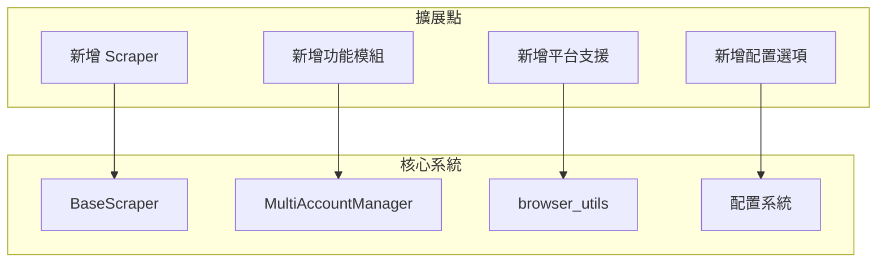

# SeleniumTCat 擴展開發指南

## 擴展開發概覽

SeleniumTCat 採用可擴展的架構設計，支援開發者輕鬆新增新的功能和爬蟲模組。本指南將詳細說明如何擴展系統的各個部分。



## 新增 Scraper 爬蟲

### 1. 基本結構

#### 1.1 建立新的 Scraper 類別

```python
# src/scrapers/new_scraper.py
#!/usr/bin/env python3
# -*- coding: utf-8 -*-

import sys
import os
import time
from datetime import datetime
from pathlib import Path

# 導入共用模組
sys.path.insert(0, os.path.join(os.path.dirname(os.path.abspath(__file__)), '..', '..'))
from src.utils.windows_encoding_utils import safe_print, check_pythonunbuffered
from src.core.base_scraper import BaseScraper
from src.core.multi_account_manager import MultiAccountManager

# 檢查環境變數
check_pythonunbuffered()

from selenium.webdriver.common.by import By
from selenium.webdriver.support.ui import WebDriverWait
from selenium.webdriver.support import expected_conditions as EC


class NewScraper(BaseScraper):
    """
    新的爬蟲類別範例
    繼承自 BaseScraper，實作特定的資料抓取功能
    """

    def __init__(self, username, password, headless=False,
                 download_base_dir="downloads", custom_param=None):
        # 呼叫父類別建構子
        super().__init__(username, password, headless, download_base_dir)

        # 新 Scraper 特有的屬性
        self.custom_param = custom_param
        self.data_to_extract = []

    def navigate_to_query_page(self):
        """
        導航到查詢頁面 - 實作父類別的抽象方法

        Returns:
            bool: 導航成功返回 True，失敗返回 False
        """
        safe_print("🧭 導航到新功能查詢頁面...")

        try:
            # 實作特定的導航邏輯
            target_url = "https://www.example.com/new-feature"
            self.driver.get(target_url)
            time.sleep(3)

            # 檢查是否成功到達目標頁面
            if "new-feature" in self.driver.current_url:
                safe_print("✅ 成功導航到查詢頁面")
                return True
            else:
                safe_print("❌ 導航失敗")
                return False

        except Exception as e:
            safe_print(f"❌ 導航過程發生錯誤: {e}")
            return False

    def download_data(self):
        """
        下載資料 - 實作父類別的抽象方法

        Returns:
            list: 下載的檔案清單
        """
        safe_print("📥 開始下載新功能資料...")

        # 設定臨時下載目錄
        self.setup_temp_download_dir()
        downloaded_files = []

        try:
            # 實作具體的下載邏輯
            download_success = self._execute_download_process()

            if download_success:
                # 處理下載的檔案
                raw_files = list(self.download_dir.glob("*.xlsx"))
                renamed_files = self._rename_downloaded_files(raw_files)

                # 移動到最終目錄並清理
                final_files = self.move_and_cleanup_files(raw_files, renamed_files)
                downloaded_files.extend(final_files)

            return downloaded_files

        except Exception as e:
            safe_print(f"❌ 下載過程發生錯誤: {e}")
            return []

    def _execute_download_process(self):
        """執行下載流程的內部方法"""
        try:
            # 1. 設定搜尋條件
            self._set_search_criteria()

            # 2. 執行搜尋
            search_success = self._perform_search()
            if not search_success:
                return False

            # 3. 下載結果
            download_success = self._download_results()
            return download_success

        except Exception as e:
            safe_print(f"❌ 執行下載流程失敗: {e}")
            return False

    def _set_search_criteria(self):
        """設定搜尋條件"""
        safe_print("🔍 設定搜尋條件...")
        # 實作搜尋條件設定邏輯
        pass

    def _perform_search(self):
        """執行搜尋"""
        safe_print("🔎 執行搜尋...")
        # 實作搜尋邏輯
        return True

    def _download_results(self):
        """下載搜尋結果"""
        safe_print("📥 下載搜尋結果...")
        # 實作下載邏輯
        return True

    def _rename_downloaded_files(self, files):
        """重新命名下載的檔案"""
        renamed_files = []

        for i, file_path in enumerate(files):
            # 生成新的檔案名
            timestamp = datetime.now().strftime("%Y%m%d_%H%M%S")
            new_name = f"新功能資料_{self.username}_{timestamp}_{i+1}.xlsx"
            new_path = file_path.parent / new_name

            # 重新命名
            file_path.rename(new_path)
            renamed_files.append(new_path)
            safe_print(f"📝 檔案已重新命名: {file_path.name} → {new_name}")

        return renamed_files


def main():
    """主程式入口"""
    import argparse

    parser = argparse.ArgumentParser(description='新功能自動下載工具')
    parser.add_argument('--headless', action='store_true', help='使用無頭模式')
    parser.add_argument('--custom-param', type=str, help='自訂參數')

    args = parser.parse_args()

    try:
        print("🚀 新功能自動下載工具")

        manager = MultiAccountManager("accounts.json")
        headless_arg = True if '--headless' in sys.argv else None

        manager.run_all_accounts(
            NewScraper,
            headless_override=headless_arg,
            custom_param=args.custom_param
        )

        return 0

    except Exception as e:
        print(f"⛔ 錯誤: {e}")
        return 1


if __name__ == "__main__":
    main()
```

### 2. 進階功能實作

#### 2.1 會話管理和錯誤恢復

```python
def _handle_session_issues(self):
    """處理會話相關問題"""
    # 檢查會話超時
    if self._check_session_timeout():
        safe_print("⏰ 檢測到會話超時，嘗試恢復...")
        recovery_success = self._handle_session_timeout()
        if not recovery_success:
            safe_print("❌ 會話恢復失敗")
            return False

    # 檢查其他會話問題
    return True

def _handle_custom_alerts(self):
    """處理特定的彈窗"""
    try:
        alert = self.driver.switch_to.alert
        alert_text = alert.text
        safe_print(f"🔔 檢測到彈窗: {alert_text}")

        # 根據彈窗內容決定處理方式
        if "特定關鍵字" in alert_text:
            safe_print("✅ 接受特定提示")
            alert.accept()
            return True
        else:
            safe_print("⚠️ 未知彈窗，謹慎處理")
            alert.dismiss()
            return False

    except Exception:
        return True  # 沒有彈窗
```

#### 2.2 AJAX 和動態內容處理

```python
def _wait_for_ajax_completion(self, timeout=30):
    """等待 AJAX 請求完成"""
    try:
        # 等待 jQuery AJAX 完成
        WebDriverWait(self.driver, timeout).until(
            lambda driver: driver.execute_script("return jQuery.active == 0")
        )
        safe_print("✅ AJAX 請求已完成")
        return True
    except Exception as e:
        safe_print(f"⚠️ AJAX 等待超時: {e}")
        return False

def _wait_for_element_clickable(self, selector, timeout=10):
    """等待元素可點擊"""
    try:
        element = WebDriverWait(self.driver, timeout).until(
            EC.element_to_be_clickable((By.CSS_SELECTOR, selector))
        )
        return element
    except Exception as e:
        safe_print(f"⚠️ 元素不可點擊: {selector}, {e}")
        return None
```

## 新增功能模組

### 1. 擴展 MultiAccountManager

#### 1.1 新增管理器功能

```python
# src/core/enhanced_account_manager.py
from .multi_account_manager import MultiAccountManager
import asyncio
import concurrent.futures


class EnhancedAccountManager(MultiAccountManager):
    """增強的多帳號管理器"""

    def __init__(self, config_file="accounts.json"):
        super().__init__(config_file)
        self.parallel_limit = 3  # 平行處理限制

    async def run_accounts_parallel(self, scraper_class, max_workers=None, **kwargs):
        """平行處理多個帳號"""
        accounts = self.get_enabled_accounts()
        max_workers = max_workers or min(len(accounts), self.parallel_limit)

        safe_print(f"🚀 開始平行處理 {len(accounts)} 個帳號 (最大併發: {max_workers})")

        with concurrent.futures.ThreadPoolExecutor(max_workers=max_workers) as executor:
            # 建立任務
            future_to_account = {
                executor.submit(self._process_account_sync, scraper_class, account, **kwargs): account
                for account in accounts
            }

            results = []
            for future in concurrent.futures.as_completed(future_to_account):
                account = future_to_account[future]
                try:
                    result = future.result()
                    results.append(result)
                    safe_print(f"✅ 帳號 {account['username']} 處理完成")
                except Exception as e:
                    safe_print(f"❌ 帳號 {account['username']} 處理失敗: {e}")
                    results.append({
                        "success": False,
                        "username": account['username'],
                        "error": str(e)
                    })

        return results

    def _process_account_sync(self, scraper_class, account, **kwargs):
        """同步處理單一帳號（供執行緒池使用）"""
        scraper = scraper_class(
            username=account['username'],
            password=account['password'],
            **kwargs
        )
        return scraper.run_full_process()
```

### 2. 新增工具模組

#### 2.1 資料處理工具

```python
# src/utils/data_processor.py
import pandas as pd
from pathlib import Path
from typing import List, Dict, Any


class DataProcessor:
    """資料處理工具類別"""

    @staticmethod
    def merge_excel_files(file_paths: List[Path], output_path: Path) -> bool:
        """合併多個 Excel 檔案"""
        try:
            combined_data = []

            for file_path in file_paths:
                df = pd.read_excel(file_path)
                df['來源檔案'] = file_path.name
                combined_data.append(df)

            # 合併資料
            merged_df = pd.concat(combined_data, ignore_index=True)
            merged_df.to_excel(output_path, index=False)

            safe_print(f"✅ 已合併 {len(file_paths)} 個檔案到 {output_path}")
            return True

        except Exception as e:
            safe_print(f"❌ 合併檔案失敗: {e}")
            return False

    @staticmethod
    def generate_summary_report(data: List[Dict[str, Any]]) -> Dict[str, Any]:
        """生成摘要報告"""
        total_accounts = len(data)
        successful_accounts = sum(1 for item in data if item.get('success', False))
        total_downloads = sum(len(item.get('downloads', [])) for item in data)

        return {
            "總帳號數": total_accounts,
            "成功帳號數": successful_accounts,
            "成功率": f"{(successful_accounts/total_accounts)*100:.1f}%" if total_accounts > 0 else "0%",
            "總下載檔案數": total_downloads,
            "平均每帳號下載": f"{total_downloads/successful_accounts:.1f}" if successful_accounts > 0 else "0"
        }
```

## 新增平台支援

### 1. 擴展瀏覽器支援

#### 1.1 新增 Firefox 支援

```python
# src/core/firefox_utils.py
from selenium import webdriver
from selenium.webdriver.firefox.service import Service
from webdriver_manager.firefox import GeckoDriverManager
from pathlib import Path
import os


def init_firefox_browser(headless=False, download_dir="downloads"):
    """初始化 Firefox 瀏覽器"""
    try:
        firefox_options = webdriver.FirefoxOptions()

        if headless:
            firefox_options.add_argument('--headless')

        # 設定下載目錄
        download_path = Path(download_dir).absolute()
        download_path.mkdir(parents=True, exist_ok=True)

        firefox_options.set_preference("browser.download.folderList", 2)
        firefox_options.set_preference("browser.download.manager.showWhenStarting", False)
        firefox_options.set_preference("browser.download.dir", str(download_path))
        firefox_options.set_preference("browser.helperApps.neverAsk.saveToDisk",
                                     "application/vnd.openxmlformats-officedocument.spreadsheetml.sheet")

        # 自動管理 GeckoDriver
        service = Service(GeckoDriverManager().install())

        driver = webdriver.Firefox(service=service, options=firefox_options)
        wait = WebDriverWait(driver, 10)

        safe_print("✅ Firefox 瀏覽器初始化成功")
        return driver, wait

    except Exception as e:
        safe_print(f"❌ Firefox 瀏覽器初始化失敗: {e}")
        raise
```

#### 1.2 瀏覽器選擇機制

```python
# src/core/browser_factory.py
from .browser_utils import init_chrome_browser
from .firefox_utils import init_firefox_browser


class BrowserFactory:
    """瀏覽器工廠類別"""

    SUPPORTED_BROWSERS = {
        'chrome': init_chrome_browser,
        'firefox': init_firefox_browser,
    }

    @classmethod
    def create_browser(cls, browser_type='chrome', **kwargs):
        """建立指定類型的瀏覽器"""
        if browser_type not in cls.SUPPORTED_BROWSERS:
            raise ValueError(f"不支援的瀏覽器類型: {browser_type}")

        init_func = cls.SUPPORTED_BROWSERS[browser_type]
        return init_func(**kwargs)

    @classmethod
    def get_available_browsers(cls):
        """取得可用的瀏覽器清單"""
        available = []
        for browser_type in cls.SUPPORTED_BROWSERS:
            try:
                # 嘗試初始化瀏覽器
                driver, wait = cls.create_browser(browser_type, headless=True)
                driver.quit()
                available.append(browser_type)
            except Exception:
                pass
        return available
```

## 新增配置選項

### 1. 擴展配置系統

#### 1.1 進階配置結構

```python
# src/core/advanced_config.py
import json
from pathlib import Path
from typing import Dict, Any, Optional


class AdvancedConfig:
    """進階配置管理器"""

    def __init__(self, config_file="accounts.json", schema_file="config_schema.json"):
        self.config_file = config_file
        self.schema_file = schema_file
        self.config = {}
        self.schema = {}

        self.load_schema()
        self.load_config()

    def load_schema(self):
        """載入配置檔案結構定義"""
        if Path(self.schema_file).exists():
            with open(self.schema_file, 'r', encoding='utf-8') as f:
                self.schema = json.load(f)

    def load_config(self):
        """載入並驗證配置"""
        with open(self.config_file, 'r', encoding='utf-8') as f:
            self.config = json.load(f)

        self.validate_config()

    def validate_config(self):
        """驗證配置符合結構定義"""
        if not self.schema:
            return True

        # 實作配置驗證邏輯
        errors = self._validate_against_schema(self.config, self.schema)
        if errors:
            raise ValueError(f"配置驗證失敗: {'; '.join(errors)}")

    def _validate_against_schema(self, config, schema):
        """根據結構定義驗證配置"""
        errors = []
        # 實作詳細的驗證邏輯
        return errors

    def get_scraper_config(self, scraper_name: str) -> Dict[str, Any]:
        """取得特定爬蟲的配置"""
        scraper_configs = self.config.get('scrapers', {})
        return scraper_configs.get(scraper_name, {})

    def get_global_setting(self, setting_name: str, default=None):
        """取得全域設定"""
        return self.config.get('settings', {}).get(setting_name, default)
```

#### 1.2 配置檔案結構範例

```json
{
  "accounts": [
    {
      "username": "account1",
      "password": "password1",
      "enabled": true,
      "profile": "standard"
    }
  ],
  "settings": {
    "headless": false,
    "download_base_dir": "downloads",
    "browser_type": "chrome",
    "parallel_limit": 3,
    "retry_attempts": 3,
    "timeout": {
      "page_load": 30,
      "element_wait": 10,
      "download": 60
    }
  },
  "scrapers": {
    "payment_scraper": {
      "default_period": 1,
      "max_periods": 5,
      "file_prefix": "客樂得對帳單"
    },
    "freight_scraper": {
      "default_date_range": 30,
      "file_prefix": "發票明細"
    }
  },
  "profiles": {
    "standard": {
      "timeout_multiplier": 1.0,
      "retry_attempts": 3
    },
    "slow_connection": {
      "timeout_multiplier": 2.0,
      "retry_attempts": 5
    }
  }
}
```

## 測試和驗證

### 1. 單元測試範本

```python
# tests/unit/test_new_scraper.py
import pytest
from unittest.mock import Mock, patch, MagicMock
from src.scrapers.new_scraper import NewScraper


class TestNewScraper:
    """NewScraper 單元測試"""

    @pytest.fixture
    def scraper(self):
        """建立測試用的 NewScraper 實例"""
        return NewScraper("test_user", "test_pass", custom_param="test")

    @patch('src.scrapers.new_scraper.init_chrome_browser')
    def test_navigate_to_query_page_success(self, mock_init_browser, scraper):
        """測試成功導航到查詢頁面"""
        # 設定模擬對象
        mock_driver = Mock()
        mock_driver.current_url = "https://www.example.com/new-feature"
        mock_init_browser.return_value = (mock_driver, Mock())

        scraper.driver = mock_driver

        # 執行測試
        result = scraper.navigate_to_query_page()

        # 驗證結果
        assert result is True
        mock_driver.get.assert_called_once()

    def test_download_data_with_custom_param(self, scraper):
        """測試使用自訂參數下載資料"""
        # 設定模擬環境
        scraper.driver = Mock()
        scraper.download_dir = Mock()

        with patch.object(scraper, '_execute_download_process') as mock_download:
            mock_download.return_value = True

            result = scraper.download_data()

            assert isinstance(result, list)
            mock_download.assert_called_once()
```

### 2. 整合測試範本

```python
# tests/integration/test_new_scraper_integration.py
import pytest
from src.scrapers.new_scraper import NewScraper
from src.core.multi_account_manager import MultiAccountManager


class TestNewScraperIntegration:
    """NewScraper 整合測試"""

    @pytest.fixture
    def test_config(self, tmp_path):
        """建立測試用配置檔案"""
        config_file = tmp_path / "test_accounts.json"
        config_data = {
            "accounts": [
                {
                    "username": "test_user",
                    "password": "test_pass",
                    "enabled": True
                }
            ],
            "settings": {
                "headless": True,
                "download_base_dir": str(tmp_path / "downloads")
            }
        }

        with open(config_file, 'w', encoding='utf-8') as f:
            json.dump(config_data, f)

        return str(config_file)

    def test_full_workflow_with_manager(self, test_config):
        """測試與 MultiAccountManager 的完整工作流程"""
        manager = MultiAccountManager(test_config)

        # 這裡可能需要模擬網站回應
        with patch('src.scrapers.new_scraper.NewScraper.navigate_to_query_page') as mock_nav:
            mock_nav.return_value = True

            results = manager.run_all_accounts(NewScraper, custom_param="integration_test")

            assert len(results) == 1
            assert results[0]['username'] == 'test_user'
```

## 部署和打包

### 1. 建立安裝腳本

```python
# scripts/install_extension.py
#!/usr/bin/env python3
"""擴展模組安裝腳本"""

import shutil
from pathlib import Path


def install_new_scraper():
    """安裝新的爬蟲模組"""
    source_dir = Path("extensions/new_scraper")
    target_dir = Path("src/scrapers")

    if not source_dir.exists():
        print("❌ 找不到擴展模組目錄")
        return False

    # 複製檔案
    for file_path in source_dir.glob("*.py"):
        target_path = target_dir / file_path.name
        shutil.copy2(file_path, target_path)
        print(f"✅ 已安裝: {file_path.name}")

    print("🎉 擴展模組安裝完成")
    return True


if __name__ == "__main__":
    install_new_scraper()
```

### 2. 版本管理

```python
# src/core/extension_manager.py
class ExtensionManager:
    """擴展管理器"""

    def __init__(self):
        self.extensions = {}
        self.load_extensions()

    def load_extensions(self):
        """載入所有可用的擴展"""
        extension_dir = Path("src/scrapers")

        for file_path in extension_dir.glob("*_scraper.py"):
            module_name = file_path.stem
            try:
                # 動態載入模組
                spec = importlib.util.spec_from_file_location(module_name, file_path)
                module = importlib.util.module_from_spec(spec)
                spec.loader.exec_module(module)

                # 尋找 Scraper 類別
                scraper_class = getattr(module, f"{module_name.title().replace('_', '')}")
                self.extensions[module_name] = scraper_class

            except Exception as e:
                print(f"⚠️ 載入擴展 {module_name} 失敗: {e}")

    def get_available_scrapers(self):
        """取得可用的爬蟲清單"""
        return list(self.extensions.keys())

    def create_scraper(self, scraper_name, **kwargs):
        """建立指定的爬蟲實例"""
        if scraper_name not in self.extensions:
            raise ValueError(f"未知的爬蟲類型: {scraper_name}")

        scraper_class = self.extensions[scraper_name]
        return scraper_class(**kwargs)
```

---

通過遵循本擴展指南，開發者可以輕鬆地為 SeleniumTCat 添加新功能，同時保持系統的一致性和可維護性。